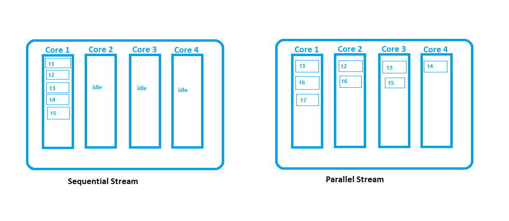

**_Lambda_**
Lambda was a way to bring in functional programing as a new Java paradigm. All code until then in Java were associated with classes and objects and piece of code couldn’t exist in isolation. To get a less complex and more readable, maintainable code functional programming was introduced.

We will consider a piece of code written in versions before Java 8, say Java 7

```java
public interface Greet {
	public void perform();
}

```

```java

public class HelloGreeting implements Greet{

	@Override
	public void perform() {
		System.out.println("Hello Greeting You");
	}

}

```

```java

public class Lambda {

	public void greet(Greet greet) {
		greet.perform();
	}

	public static void main(String[] args) {
		Lambda obj=new Lambda();
		Greet greet=new HelloGreeting();
		obj.greet(greet);
	}

}

```

Here we are passing the greet object and hence through this finding an implementation of Greet interface that has the suitable perform() method. The Code is quite lengthy here. It would be great if instead of passing the Object one could actually pass action or function in isolation instead of objects.
This can be done as below from Java 8 just passing the action using a Functional Interface
Like previous example we need an Interface but this would be a Functional Interface. Meaning a SAM interface which means it should constitute of only a Single Abstract Method. The @FunctionalInterface is and optional annotation but it’s a good practise to use it so that anywhere in future the Interface’s purpose is known to be SAM.

```java
@FunctionalInterface
public interface Greet {
	public void perform(); //declare only one abstract method
	default void foo() {
		System.out.println("deafult defined method");
	}
	static void func() {
		System.out.println("another static defined method");
	}
}

```

Adding any other abstract method in this Interface would result in a Compilation error.

```java

public class Lambda {

	public void greet(Greet greet) {
		greet.perform();
	}

	public static void main(String[] args) {
		Lambda obj=new Lambda();
		obj.greet(()->System.out.println("Hello Greeting You"));
	}

}

```

The program can be reduced significantly using lambda. Here the representation is :
(para)->{what need to be executed? statements;}
The parameters and statements can be of any number but the number abstract methods in the functional interface should be exactly one. Otherwise the lambda would not be able to be defined accurately and will get confused as to which method it should take into consideration.

```java

public class Lambda {

	public void greet(Greet greet) {
		greet.perform();
	}

	public static void main(String[] args) {
		Lambda obj=new Lambda();
		obj.greet(()->System.out.println("Hello Greeting You"));
		Add add=(a,b)->a+b;
		System.out.println(add.sum(2, 5));
		StringLength length=s->s.length();
		System.out.println(length.getlength("udgdfgfg"));
	}

}

interface Add{
	int sum(int a,int b);
}
interface StringLength{
	int getlength(String s);
}

```

Consider list of people and sort list by lastname, print all elements after sorting and print people that have lastname beginning with “C”.
**_Ways to create lambda expressions_**
• Create a Functional Interface and a single abstract method declaration
• Use out of the box functional interfaces provided in jdk if avaialable

Take a collection of person, sort it in terms of lastname, print the names in the soted order and the print the names only with C in the beginning of lastname.
Before Java8:

```java
import java.util.Arrays;
import java.util.Collections;
import java.util.Comparator;
import java.util.List;

public class Main {

	public static void main(String[] args) {
		List<Person> people=Arrays.asList(new Person("Fudge","Cornelius"),
				new Person("Serious","Black"),
				new Person("Severus","Snape"),
				new Person("James","Potter"),
				new Person("Remus","Lupin"),
				new Person("Colin","Creevey"));
		Collections.sort(people,new Comparator<Person>() {

			@Override
			public int compare(Person o1, Person o2) {
				return o1.getLastname().compareTo(o2.getLastname());
			}
		}); //we create anonymous comparator class

		printconditionally(people,new Condition() {

			@Override
			public boolean test(Person p) {
					return true;
			}
			});
//we create anonymous condition class for our created condition interface

		printconditionally(people,new Condition() {

			@Override
			public boolean test(Person p) {
					return p.getLastname().startsWith("C");
			}
			});
//we create anonymous condition class for our created condition interface

	}

//	public static void printall(List<Person> people) {
//		for(Person p:people)
//			System.out.println(p);
//	}
//
	public static void printconditionally(List<Person> people,Condition conditon) {
		for(Person p:people) {
			if(conditon.test(p))
				System.out.println(p);
		}
	}
	public interface Condition {
		boolean test(Person p);
	}
}

```

Minimising this humungous code using lambda ,Predicate and Consumer :

```java

import java.util.Arrays;
import java.util.Collections;
import java.util.List;
import java.util.function.Consumer;
import java.util.function.Predicate;

public class Main {

	public static void main(String[] args) {
		List<Person> people=Arrays.asList(new Person("Fudge","Cornelius"),
				new Person("Serious","Black"),
				new Person("Severus","Snape"),
				new Person("James","Potter"),
				new Person("Remus","Lupin"),
				new Person("Colin","Creevey"));
		Collections.sort(people,(p1, p2)-> p1.getLastname().compareTo(p2.getLastname()));

		printconditionally(people,p->true,p->System.out.println(p)); //using Predicate Functional Interface

		printconditionally(people,p->p.getLastname().startsWith("C"),p->System.out.println(p));
	}


	public static void printconditionally(List<Person> people,Predicate<Person> predicate,Consumer<Person> consumer) {
		for(Person p:people) {
			if(predicate.test(p))
				consumer.accept(p);
		}
	}

}

```

**_Java has provided Some common Interfaces for common method operations. Some of the mainly used once are Predicate, Consumer, Supplier and Function._**
=>Predicate: boolean test(Object parameter) – returns a boolean
=>Consumer: void accept(T t)- just accepts values returning nothing
=>Supplier: T get()- returns values of type T
=>Function: R apply(T t)- applies a particular function on an argument given and return new results

**_Streams_**
• Consider it as giving out objects in stream like moving in conveyer belt in the airport
• They are related to collections framework or collection of objects
• Used to perform bulk operations and process objects of collections
• Reduces code length

```java

import java.util.Arrays;
import java.util.List;
import java.util.stream.Collectors;
import java.util.stream.Stream;

public class Main {

	public static void main(String[] args){

		List<Integer> list_num=List.of(2,4,5,6,7,3,1,9,8);
		//get a filter out of all even numbers from a list
		list_num.stream().filter(i->i%2==0).collect(Collectors.toList());
		//System.out.println(list_num.stream().filter(i->i%2==0).collect(Collectors.toList()));

		list_num.stream().map(i->i*i).collect(Collectors.toList());
		System.out.println(list_num.stream().filter(i->i%2==0).map(i->i*i).collect(Collectors.toList()));
		/*stream returns a stream of elements,
		*filter takes in a predicate and return boolean result on the operation on it
		*map takes a function and applys it on all the elements on the stream
		*collect is a Terminal operation that at last collects the result obtained
		*/

		list_num.stream().sorted().forEach(System.out::println);
		//get a stream sort it and foreach of it do a syso
		System.out.println(list_num.stream().min((x,y)->x.compareTo(y)).get());
		System.out.println(list_num.stream().max((x,y)->x.compareTo(y)).get());
		//on the stream apply a min/max function using compareTo method and use supplier to get the result
		Stream<Object> empty=Stream.empty();
		//create an empty stream
		int array[]= {1,2,3,4,5};
		//Stream<Integer> stream=Stream.of(array);
		//make a stream with the array provided
		Stream.builder().build();
		//uses builder pattern to build a stream
		Arrays.stream(new int[] {1,2,3,4,5});
		//create stream of array using Arrays
	}

}

```

\*\*Stream breakdown:

> Creating a Stream of any required type (IntStream, DoubleStream)
> Processing the stream
> Consuming the stream

```java
import java.util.stream.Collectors;
import java.util.stream.IntStream;

public class Main3 {

	public static void main(String[] args){
		int[] numbers= {3,2,5,4,6,7,2,3,4};

		/*
		 * Creation of streams
		 */
		IntStream.of(numbers);//takes the array to streaming
		IntStream.range(1,100);//exclusive ranges
		IntStream.rangeClosed(1, 100); //inclusive ranges
		IntStream.generate(()->(int)Math.random());//generator based on supplier sent

		/*
		 * Processing the streams
		 */
		IntStream.of(numbers).distinct();//returns unique values
		IntStream.of(numbers).sorted();//returns sorted values
		IntStream.of(numbers).limit(3);//limits the output of stream to the first 3 numbers
		IntStream.of(numbers).skip(3);//skips the first 3 elements
		IntStream.of(numbers).filter(i->i%2==0);//filters the stream values based on the predicate sent
		IntStream.of(numbers).map(i->i*2);//applies the function mentioned on the param
		IntStream.of(numbers).boxed();//converts primitive types to a Wrapper type

		/*
		 * Consumption
		 */
		IntStream.of(numbers).sorted().min();//returns the min values
		IntStream.of(numbers).sorted().max();// max values
		IntStream.of(numbers).sorted().sum();//sum
		IntStream.of(numbers).sorted().average();//avg
		IntStream.of(numbers).sorted().count();//count
		IntStream.of(numbers).sorted().toArray();//returns the stream converted to array
		IntStream.of(numbers).sorted().boxed().collect(Collectors.toList());//returns the stream boxed to a Wrapper type as a list
		IntStream.of(numbers).anyMatch(num->num%2==0);//returns a boolean true value if there is any match to the condition passed
		IntStream.of(numbers).allMatch(num->num%2==0);//returns a boolean true values only if all the values jin the stream satisfy the condition
	}

}
```

**Get a List of Employees sort them based on the Salary (increasing and decreasing both) and then save it in a map**

```java
List<Employee> employees= getAllEmployees();
		employees.stream()
		.sorted(Comparator.comparingInt(Employee::getSalary))
		.limit(3).collect(Collectors.toMap(e->e.getName(), e->e.getSalary()))
		.forEach((key,value)->System.out.println(key+" => "+value));


		employees.stream()
		.sorted(Comparator.comparingInt(Employee::getSalary).reversed())
		.limit(3).collect(Collectors.toMap(e->e.getName(), e->e.getSalary()))
		.forEach((key,value)->System.out.println(key+" => "+value));
```

```java
Ron => 3000000
Harry => 4000000
Hermione => 5000000

Sirius => 7000000
Ginny => 8000000
Snape => 7000000
```

**Now convert from a list to map: say you have a list of values characters or integers. You are supposed to create a map with the element as the key and count of elements as the value.**

```java
	List<String> words=Arrays.asList("Wingardium","Leviosa","Stupefy","Stupefy","Crucio");
		System.out.println(frequency(words.stream()));

		List<Integer> number=Arrays.asList(3,4,5,2,8,7,4,5,6,1);
		System.out.println(frequency(number.stream()));
	}
```

```java

	public static <T>Map<T,Long> frequency(Stream<T> elements){
		return elements.collect(Collectors.groupingBy
				(Function.identity(),Collectors.counting()));
	}
```

```java
{Stupefy=2, Crucio=1, Leviosa=1, Wingardium=1}
{1=1, 2=1, 3=1, 4=2, 5=2, 6=1, 7=1, 8=1}
```

**Consider a list of list given you have to make it a combined list: into a stream eliminating the list variation**

```java
		List<Integer> list1 = Arrays.asList(1,2,3,4,5);
		List<Integer> list2 = Arrays.asList(6,7,8,9,10);
		List<Integer> list3 = Arrays.asList(5,8,2,9,1);
		List<List<Integer>> combinedList = new ArrayList();
		combinedList.add(list1);
		combinedList.add(list2);
		combinedList.add(list3);
		/*
		 * combinedList
		 * [1, 2, 3, 4, 5][6, 7, 8, 9, 10][5, 8, 2, 9, 1]
		 */
		 List<Integer> listcombinedList =combinedList.stream().
						flatMap(list->list.stream()).collect(Collectors.toList());
			/*
			 * listcombinedList
			 * [1, 2, 3, 4, 5, 6, 7, 8, 9, 10, 5, 8, 2, 9, 1]
			 */
```

**Stream function with operation of number\*3 on each element**

```java
	List<Integer> prod_three=Arrays.asList(3,6,7,9,12,15);
	prod_three.stream().map(num->num*3).forEach(number->System.out.print(" "+number));
	/*
	 *  9 18 21 27 36 45
	 */
```

**list of strings in lowercase has to be converted to all uppercase**

```java
	List<String> lowercase=Arrays.asList("i","was","running","far","away","would","i","run","off","the","world","someday","nobody","know");
	List<String> uppercase=lowercase.stream().map(string->string.toUpperCase()).collect(Collectors.toList());
	/*
	 * lowercase
	 * [i, was, running, far, away, would, i, run, off, the, world, someday, nobody, know]
	 * uppercase
	 * [I, WAS, RUNNING, FAR, AWAY, WOULD, I, RUN, OFF, THE, WORLD, SOMEDAY, NOBODY, KNOW]
	 */
```

**map string length instead of string**

```java
	List<String> aurora=Arrays.asList("i","was","running","far","away","would","i","run","off","the","world","someday","nobody","know");
	List<Integer> lengths=aurora.stream().map(length->length.length()).collect(Collectors.toList());
	System.out.println(aurora);
	System.out.println(lengths);

	/*
	 * aurora
	 * [i, was, running, far, away, would, i, run, off, the, world, someday, nobody, know]
	 * lengths
	 * [1, 3, 7, 3, 4, 5, 1, 3, 3, 3, 5, 7, 6, 4]
	 */
```

**map string with character at position 2**

```java
	List<String> full_characters=Arrays.asList("was","running","far","away","would","run","off","the","world","someday","nobody","know");
	List<Character> charat_two=full_characters.stream().map(ch->ch.charAt(2)).collect(Collectors.toList());
	/*
	 * full_characters
	 * [was, running, far, away, would, run, off, the, world, someday, nobody, know]
	 * charat_two
	 * [s, n, r, a, u, n, f, e, r, m, b, o]
	 */
```

##Perform Operations where stream reduces to single resultant value.

> It the repeated process of combining all elements
> T reduce(T identity, BinaryOperator<T> accumulator)
> identity is the initial value of type T
> accumulator is the function for combining two values
> **find the string with maximum length in a list**

```java
List<String> aurora=Arrays.asList("i","was","running","far","away","would","i","run","off","the","world","someday","nobody","know");
Optional<String> longestString=aurora.stream().reduce((word1,word2)->word1.length()>word2.length()?word1:word2);
longestString.ifPresent(str->System.out.println(str));
//longestString: someday
```

**get the combined string of all list elements**

```java
List<String> aurora=Arrays.asList("i","was","running","far","away","would","i","run","off","the","world","someday","nobody","know");
Optional<String> concated=aurora.stream().reduce((word1,word2)->word1+" "+word2);
concated.ifPresent(str->System.out.println(str));
//concated: i was running far away would i run off the world someday nobody know
```

**find sum of all elements**

```java
int[] array= {-2,0,4,6,8};
int sum=Arrays.stream(array).reduce(0, ((num1,num2)->num1+num2));
//sum: 16
```

**find product of all numbers in a given range**

```java
int product=IntStream.range(2, 8).reduce((num1,num2)->num1*num2).orElse(-1);
//product: 5040
```

**_Sequential Streams_**
Runs on a single core and one iteration occurs. Each iteration has to wait for currently running core to finish. The order is maintained during processing. Its performance reduces in case of large amounts of data else its less error prone and more reliable
**_Parallel Streams_**
Runs on multiple cores and multiple iteration occurs at a time. There is no waiting necessary unless all core are busy. The order is not maintained while processing and performance is high only in case of millions or large amounts of data. It is not very reliable and more error prone


**_Few Points to ponder_**
• Files.lines(Path path) reads all lines from file as stream
• Lambda enables us to pass functionality as its argument
• BooleanSupplier Funtional interface represents supplier of Boolean-valued results
• If parent class constructor throws any checked exception then child class constructor should throw the same checked excpetion as parent
• Constructos have no return type not even void
• Association is objects having their own lifecycle and there is no owner (happens in case of many to many mostly) aggregation is subtype a “has a” relationship where a class associates with another class ( a one to one or one to many) like a company has employees but both company and employee can be independent entities. Composition is where relationship “is-a” or “part-of” like a person has an address but address by itself has no meaning.
