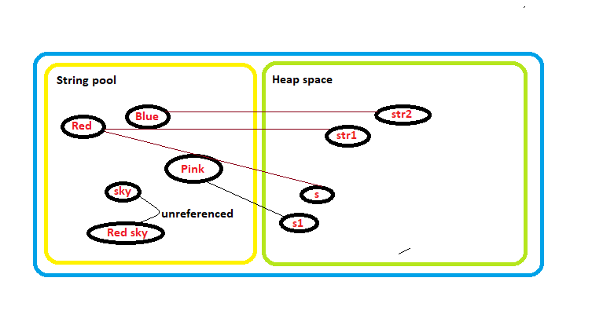

String is said to be immutable. But what does it really mean. 
String can be created by either assignment or creating a new string object. Every new string creation will result in a creation of new object in string pool. The creation of string through assignment will create a string object only in string pool but creation by new keyword would result in creation of object in head space and string pool.

Let’s take an example:
```java
String str1= ”Red”;
String str2= ”Blue”;
s=str1;
str1.concat(”sky”);
String s1=new String(“Pink”);
```
In the above case 5 object are created in string pool as shown below. But the object “Red” is referred by str1 and s too. The value in line 4 is concatenated to “Red sky” but the object is not referred by anything and hence is lost. But creating a new string object as ”Red sky” or “sky” would not create a new object in string pool but refer to the existing one.

  
This is done because memory is expensive and creating new string object can get redundant so the string pool makes the creating of string object more feasible.