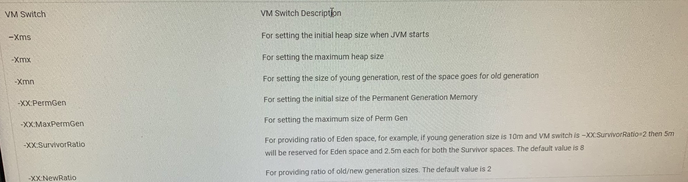
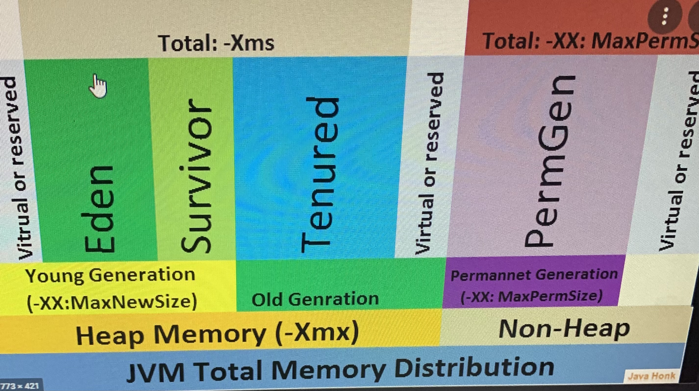

Java Heap Space is normally used to store Objects and Classes. When one creates an Objects its created its space in the Heap

Java Provides Automatic Garbage collection that is it allocates and deallocates memory by itself so that it eliminates the overhead on programs to do this task. The process of garbage collection is said to have basic processes:
**marking**: here all the referenced and live objects are marked in the memory by the garbage collector.


**normal deletion**: after marking, the unreferenced or the memory spaces that are not in use is deleted. The memory allocator then holds the references to the resulting free spaces.


Deletion with compacting: once deleted to improve performance we can compact the free spaces and live objects that are in use so that the memory allocator can keep reference to only the beginning of free space.

In real time this process of continuous marking and deletion might take a large amount of time when we involve huge number of objects so this was optimized to increase performance by breaking the heap space into small parts.
JVM Generations:
The Heap parts are: young generation, old/ tenured generation and permanent generation.
The Permanent Generation consists of metadata needed by the JVM for class loading and its operations. From Java 8 the Permanent Generation is eliminated and replaced by Metaspace that exists in the native memory which reduced the cost of compaction and resulted in deciding the size of Metaspace during runtime.


The whole process of Java garbage collection can be summarized in brief as explained below:
I. When a new object is allocated it is initially placed in the Eden space.


II. Once the Eden Space fills up it causes a Minor Garbage Collection. The dead objects/ unreferenced objects are deleted to make space for more objects to be allocated. This is a Stop the World event that suspends all other threads from continuing.


III. Once the objects get filled up in the Eden space then minor garbage collection is triggered moving all live objects to survivor s0 and a mark, compact and delete operation at Eden. here the object age is increased.


IV. Once the objects get filled up in the survivor space s0 then one more minor garbage collection is triggered moving all live objects to survivor s1 and a mark, compact and delete operation at Eden and S0. Again the age of the object increases as object moves to a different space.


V. Next time the objects are moved to S0 from Eden and S1 survivor spaces similar to above operations.


VI. Once the live objects reach a threshold age (say 8 for this instance) by surviving multiple times it becomes eligible for a Promotion to the Tenured Space that results in another Stop the World Event that takes more time and called the Major Garbage Collection.


VII. The Allocation and Promotion happens hand in hand. Once an object is allocated its moved to Young Generation and survives till its Threshold age unless its reference stays live. Once it exceeds the threshold its moved to the Tenured Generation.


Garbage Collection in Java being automatic has been a relief for me and releieved me from nightmares C gave during allocation of memory!!! 👻

**ways to make object eligible for garbage collection**
garbage collection is done by daemon thread
1.Nullifying ref variable
2.reassigning ref variable
3.object create inside method

```java
static void show()
    {
        //object t1 inside method becomes unreachable when show() removed
        Test t1 = new Test("t1");
        display();

    }
```

when method is called it goes inside stack frame and when method is popped out all the method members dies hence garbage collection is achieved
4.Land of isolation(Anonymous object or unnamed object)

Common constructs to remember when considering garbage collection

1. Throughput: Average amount of time spent during program execution and amount of time spent for running garbage collection
2. Latency: Amount of time code pauses for garbage collection to run
3. Memory: Memory assigned to the program
4. Footprint: Memory required for the garbage algorithm to run
5. Minor Collection: This happens in young generation. Most of the objects die young in young generation. All objects first live here and moves to garbage collection if they are unused or unreferenced
6. Major Collection: Objects are moved here after multiple survival from minor collection or if the object is too big to be stored in young generation
   **_Types Of Garbage Collectors_**
7. Serial
   • Works with single thread for minor and major garbage collection
   • Pauses/freezes until garbage collection is concluded
   • Smallest footprint than all other Garbage collectors
   • Best for small devices and program with small memory
   • Good for programs running on shared CPU provided one should make sure garbage collection in one CPU does not affect the other CPU
   • Command: **java –XX: +UseSerialGC –jar appname.java**

8. Parallel
   • It works with multiple threads to perform garbage collection
   • It also freezes during garbage collection
   • Greatest throughput in multiprocessors and batch applications
   • One can specify how many threads to be used for garbage collection and maximum pause that can be taken for garbage collection
   • Command: **java –XX: +UseParallelGC –jar appname.java**
   java –XX: +UseParallelGC –XX:ParallelGCThreads=number of threads
   java –XX: +UseParallelGC –XX:MaxGCPauseMillies=seconds in ms

9. Concurrent Mark and Sweep (CMS) Collector
   • It has lesser throughput but more footprint that parallel collector
   • It has smaller pause time that the parallel collector
   • It used for general applications
   • It pauses only in two case
   • One is while marking referenced objects in older generation space
   • Or two if there is a change in heap memory parallely
   • Command: ** java –XX:+UseParNewGC –jar appname.java**

10. Garbage First (G1) Collector
    • It was introduced in jdk 7 and default since jdk 9
    • It splits the heap size into multiple equal sized regions
    • More footprint that CMS collector and large heaps
    • Great for applications which need predicatble latency
    • It has lower worst case latency but higher average latency
    • Command: ** java –XX:+UseG1GC –jar appname.java**

11. Shenondoah
    • Newer version

Other important points:
• Change heap sizes using -Xms and –Xmx. Xms is the starting size of heap while Xmx is the maximum size of heap
• -Xmn denotes the size of new generation of Java Heap Space



• One cannot change size of Heap in Java dynamically, it can be provided only while starting the JVM.
• Runtime.getRuntime().ShutdownHook() is special cleanup operation during jvm/ vm shutting down
• String Pool is store in Java Heap
• PermGen consist of method area, application metadata required by JVM to describe classes and methods used in application and Java SE library classes and methods.
• PermGen is populated by JVM at runtime based on classes used by the application



• No matter how many time a package is called the JVM loads the class only once
• Extension loads jar files from lib/ext dir of JRE to provide basic functionality
• Bootstrap is class loader which loads classes into memory
• JVM is an interpreter. It reads .class file which is bytecode generated by compiler line by line and converts it into native OS code
• Bytecode is platform independent
• Three memory segment, stack segment, heap segment and code segment. Code segment loads compiled java bytecode
