Java Provides Automatic Garbage collection that is it allocates and deallocates memory by itself so that it eliminates the overhead on programs to do this task. The process of garbage collection is said to have basic processes:
**marking**: here all the referenced and live objects are marked in the memory by the garbage collector.
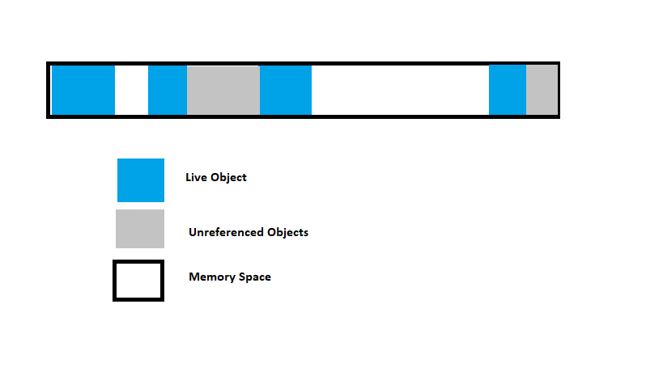

**normal deletion**: after marking, the unreferenced or the memory spaces that are not in use is deleted. The memory allocator then holds the references to the resulting free spaces.
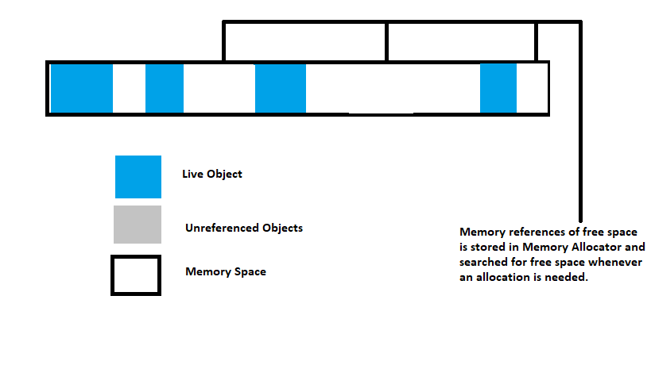

Deletion with compacting: once deleted to improve performance we can compact the free spaces and live objects that are in use so that the memory allocator can keep reference to only the beginning of free space.
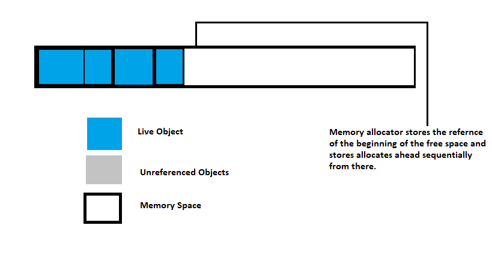
In real time this process of continuous marking and deletion might take a large amount of time when we involve huge number of objects so this was optimized to increase performance by breaking the heap space into small parts.
JVM Generations:
The Heap parts are: young generation, old/ tenured generation and permanent generation.
The Permanent Generation consists of metadata needed by the JVM for class loading and its operations. From Java 8 the Permanent Generation is eliminated and replaced by Metaspace that exists in the native memory which reduced the cost of compaction and resulted in deciding the size of Metaspace during runtime.
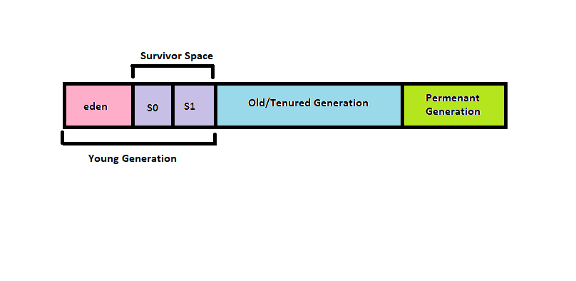

The whole process of Java garbage collection can be summarized in brief as explained below:
I. When a new object is allocated it is initially placed in the Eden space.
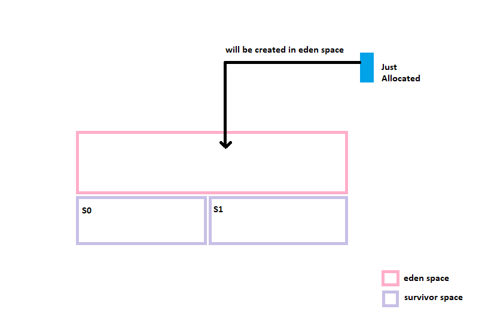

II. Once the Eden Space fills up it causes a Minor Garbage Collection. The dead objects/ unreferenced objects are deleted to make space for more objects to be allocated. This is a Stop the World event that suspends all other threads from continuing.
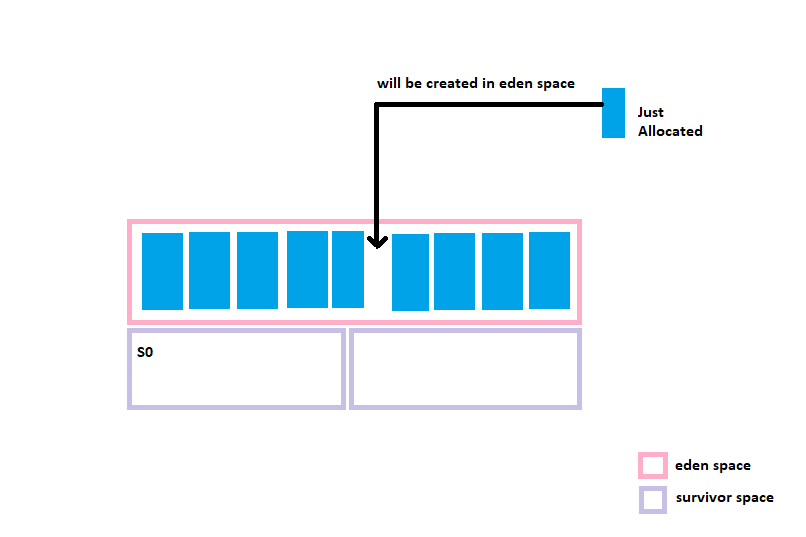

III. Once the objects get filled up in the Eden space then minor garbage collection is triggered moving all live objects to survivor s0 and a mark, compact and delete operation at Eden. here the object age is increased.
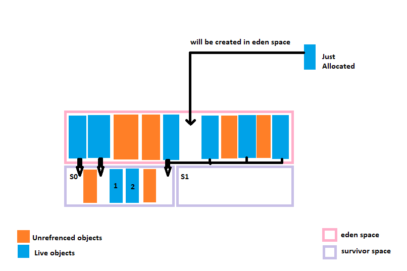

IV. Once the objects get filled up in the survivor space s0 then one more minor garbage collection is triggered moving all live objects to survivor s1 and a mark, compact and delete operation at Eden and S0. Again the age of the object increases as object moves to a different space.
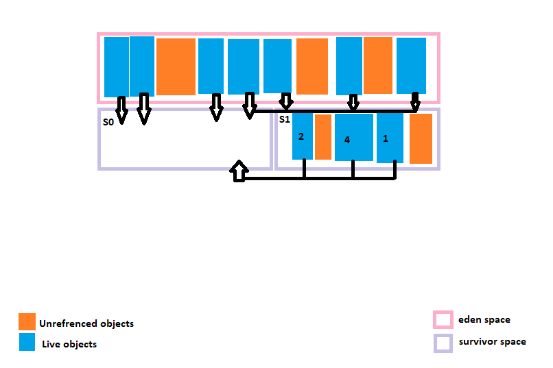

V. Next time the objects are moved to S0 from Eden and S1 survivor spaces similar to above operations.
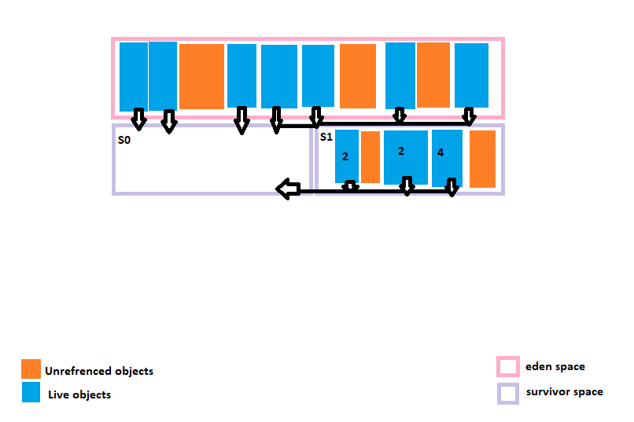

VI. Once the live objects reach a threshold age (say 8 for this instance) by surviving multiple times it becomes eligible for a Promotion to the Tenured Space that results in another Stop the World Event that takes more time and called the Major Garbage Collection.
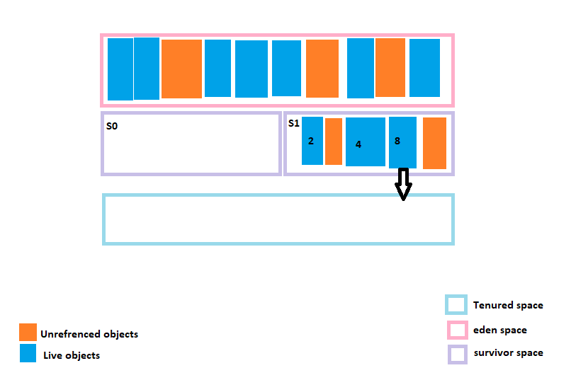

VII. The Allocation and Promotion happens hand in hand. Once an object is allocated its moved to Young Generation and survives till its Threshold age unless its reference stays live. Once it exceeds the threshold its moved to the Tenured Generation.
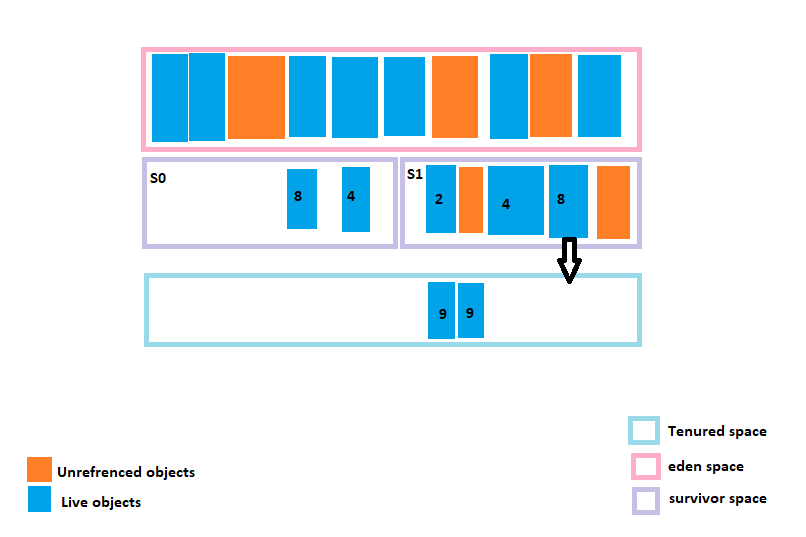
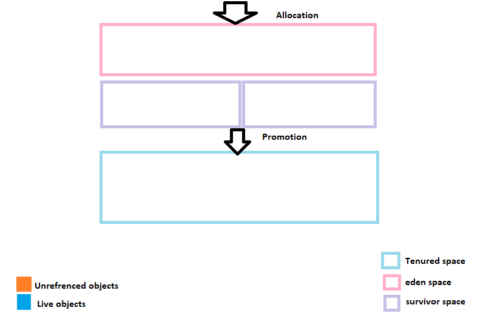

Garbage Collection in Java being automatic has been a relief for me and releieved me from nightmares C gave during allocation of memory!!! 👻
