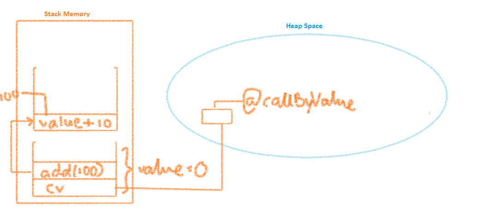
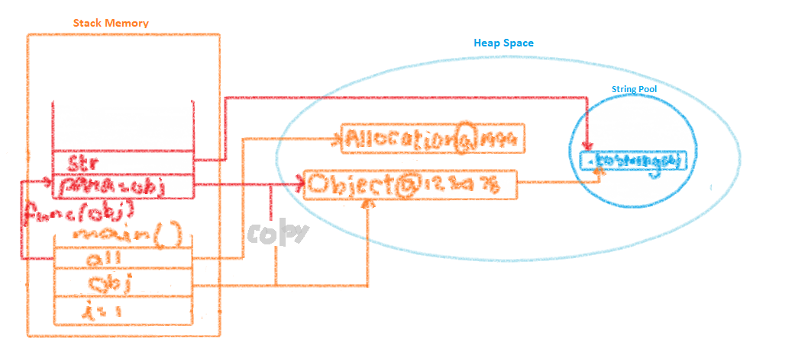
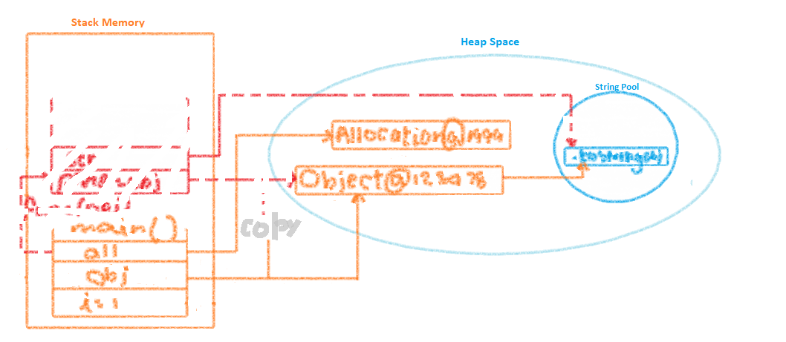

For those with c ,c++ background similar lines of method by reference with address being passed between methods will not happen in java
Reason: Java do not support pointers.

So diving in,
**Call by Value** means calling a method with parameter as a value. here, argument value is passed to the parameter. The modiciation done to parameters passed does not reflect in caller's scope(the calling method).
on other hand
**Call by Reference** means calling method via reference. The modification done to paramters passed refelects the callers scope and stays persistent. i.e., the original value is changed by the called method's modifications

**_Call by refernce and call by value in Java_**

The calls mentioned here are both the method calls.

For those with c ,c++ background similar lines of method by reference with address being passed between methods will not happen in java Reason:
Java do not support pointers. In Java reference refers to the way of accessing object

So diving in, Call by Value means calling a method with parameter as a value. here, argument value is passed to the parameter.
The modiciation done to parameters passed does not reflect in caller’s scope(the calling method).
on other hand Call by Reference means calling method via reference but in java things get a bit complicated.
The modification done stays persistent only when the modifictions done are not on the copy.

Consider a program where we pass a primitive datatype

```java
class CallByValue{
  int value=0;

  void add(int value){
    value=value+10;
    //note that we do not return these values
  }

  public static void main(String[] args){
    CallByValue cv= new CallByValue();
    // before we call the method the value is 0
    cv.add(100);
    //after we call the method the value stays 0.
    System.out.println(cv.value);
 }
}
```


The values are definitely not changed from the add method and this is clearly an example of a typical Pass By Value. The copy of the value/ variable is being passed and the changes are done local to the method once added to the Stack. Like the diagram shown:
When passing objects in java as parameters through methods things get a bit tricky people mistake it to be pass by reference as objects are created as references but its not passed as such through m,ethods. Instead a copy of the reference is passed to the method called, though both copied and orginal point top the same memroy reference.

Whilst lookinfg into this, the concept of heap and stack memory comes into picture.

**_Java Heap Space_**
=>Used to allocate memory for objects and jre classes, when an object is created its created in the Head Space
=>objects created in heap space have global access and can be accessed from anywhere in the application
=>Garbage collection runs on heap space to clear of objects that is not refered by any
=>It has complex memory allocation as its accessed globally and clearing out also is complecitaed(garbage collection of java)
=>Its larger in size but slow when it comes to operations
=>when heap is full it throws JavaHeapSpace Error

**_Java Stack Mempry_**
=>used to allocate memory during thread execution and contain method specific values and references to objects in heap when there need to be a reference
=>Values in stack are short lived and are cleared out when the execution ends to be replaced by a new block for new methods
=>it adds values in LIFO order
=>the size is less but simple memroy management and allocation makes it faster with operations
=>when stack is full it throws StackOverFlow error

program and its pictorial illustration to understand how the values are stored in stack and Heap

```java
class Allocation{
  int value=0;

  void foo(Object para){
	  String str=para.toString();
	  System.out.println(str);
  }

  public static void main(String[] args){
	  int i=1;
	  Object obj=new Object();
	  Allocation all= new Allocation();
	  all.foo(obj);
 }
}
```


when foo method execution completes the meory is cleared outand hence changes done to the object becomes irrelevant as the copy is deleted.
\*\*Note: changes that has refelected in original object due to the method would stay intact: ex: setting some value to data memebers

Changing object itself do not reflect in changes in object
to refelct changes in java:
1.one has to make the object wrap around anouther object to make it a datamemeber and set datamemeber value
eg: Swap example where objects do not get swapped unless you nake the object a datamember using a Wrapper

```java
public class Object_swap{
  public static void swap(Integer a, Integer b) {
	  Integer temp=a;
	  a=b;
	  b=temp;
  }
	public static void main(String[] args){
	Integer a=new Integer(10);
	Integer b=new Integer(20);
	System.out.println("Before swap a: "+a+" b: "+b);
	swap(a,b);
	System.out.println("After swap a: "+a+" b: "+b);
 }
}
```

add a wrapper class:

```java
public class Allocation{


	static class Object_wrap{
		public Integer id;
		public Object_wrap(Integer id) {
			this.id=id;
		}
	}
  public static void swap(Object_wrap a, Object_wrap b) {
	  Integer temp=a.id;
	  a.id=b.id;
	  b.id=temp;
  }
	public static void main(String[] args){
		Object_wrap a=new Object_wrap(10);
		Object_wrap b=new Object_wrap(20);
		System.out.println("Before swap a: "+a.id+" b: "+b.id);
		swap(a,b);
		System.out.println("After swap a: "+a.id+" b: "+b.id);
 }
}
```

2. return the value to be reflected

```java
class CallByValue{
  int value=0;

  public void int add(int value){
    value=value+10;
    retrun value;
  }

  public static void main(String[] args){
    CallByValue cv= new CallByValue();
    // before we call the method the value is 0
    cv.value=cv.add(100);
    //after we call the method the value stays 0.
    System.out.println(cv.value);
 }
}
```
