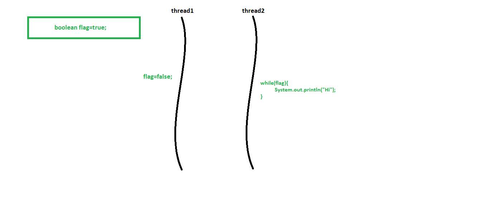
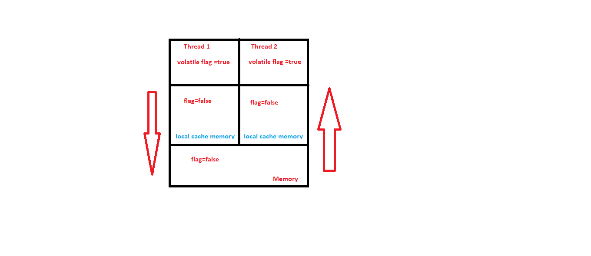
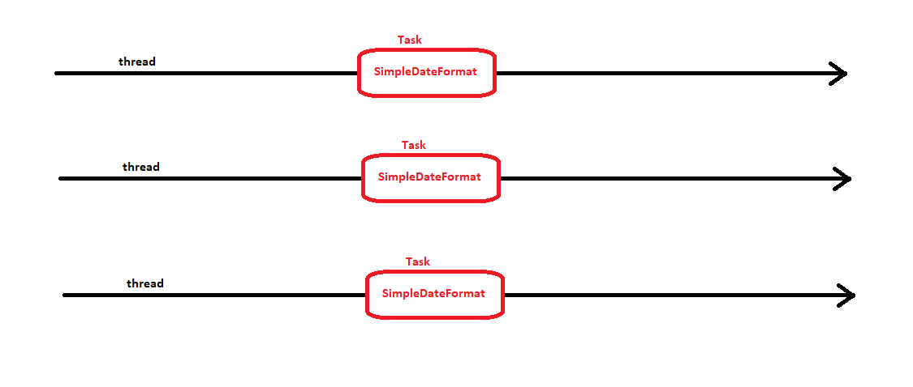
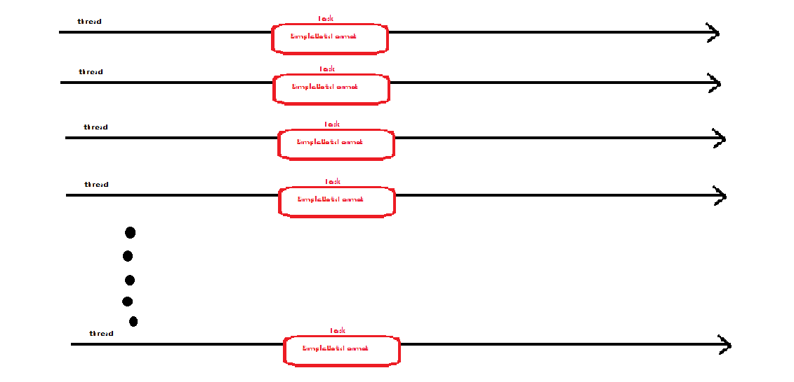
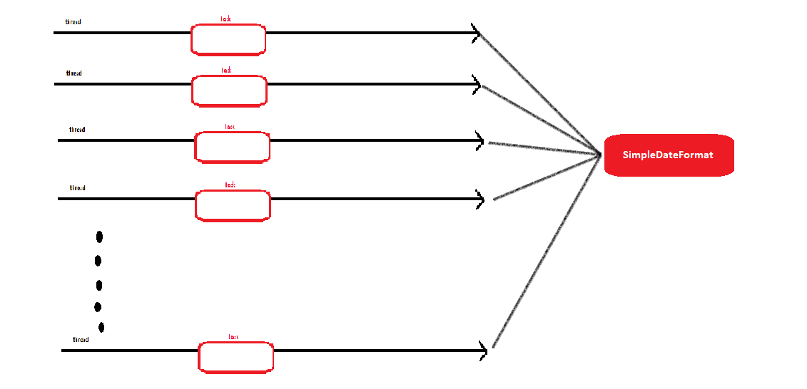
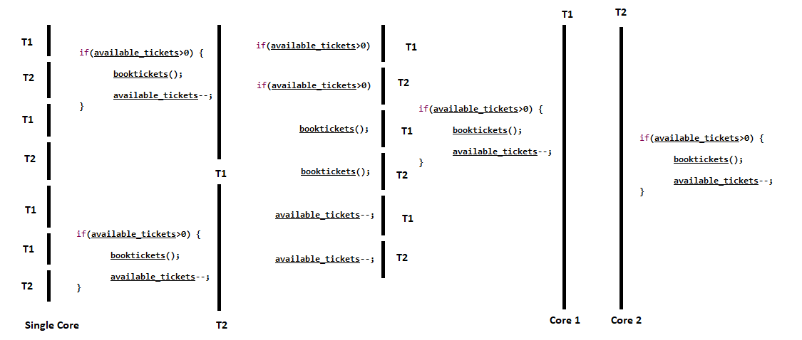

One can create threads extending Thread or implementing runnable. Both has the method void run() for operating thread operations. Now assuming that we want our run to return a value the this isn’t possible with thread and runnable. That’s why there is a Callable<T> Interface. And method T call().

In ExecutorService where we submit task. The submit() method which accepts the callable object which returns a value of Type<T>. The execute() method of ExecutorService expects a runnable object hence for a callable object it uses the submit() method and to store it in the variable of type Future<T>.

```java
int corecount=Runtime.getRuntime.availableProcessors();
ExecutorService service=Executors.newFixedThreadPool(corecount);
for(int i=0;i<1000;i++){
	Future<Integer> future=service.submit(new Task()); //Task implements Callable<Integer>
}
```

**_Volatile vs atomic_**


Here thread1 and thread2 are run together but the variable might not change due to the Visibility problem where thread1 and thread 2 do not reflect changes as they are not aware of the changes undergone in the cache.
The reason underlies in the way the memory is structured.


Here we see the variable values do not reflect the changes from cache unless we declare the variable as volatile where we actually indiacate that the variable has to impact the memory and pick changes from there rather than the local cache.


The next problem lies when we have the synchronization problem for any compound operations.


Consider this example where value is being incremented by 2 threads we would want it to be synchronously behaving but this will based on our processors behave like so
• first change value to 2 by thread 1
• again thread 2 would change value to 2 from 1 since it doesn’t know that thread 1 has changed the value prior to this
To solve this one can approach 2 solutions 1 the AtomicInteger or synchronize the blocks.


Using synchronized keyword one can make sure that only one thread can enter the block to do the operation.


One can also choose to use AtomicInteger to ensure that read and write in a thread is done atomically. It’s the responsibility of the jvm to do the operations atomically. Atomic in java also offers methos to increment, decrement or compare.

```java
AtomicInteger value= new AtomicInteger(1);
value.increment();
```

If there is a visibility problem, use volatile and if there is a synchronization problem use Atomic.

**_ThreadLocal_**

Consider the code where you need a Dateformat Object for some task. Each task is taken up by one thread and each thread would take a required object.

```java
public class UserService {

	public static void main(String[] args) {
		/*
		 * DateFormat object for each thread and for each task
		 */
		new Thread(()->{
			String birthdate=new UserService().birthDate(100);
			System.out.println(birthdate);
		}).start();

		new Thread(()->{
			String birthdate=new UserService().birthDate(100);
			System.out.println(birthdate);
		}).start();

		new Thread(()->{
			String birthdate=new UserService().birthDate(100);
			System.out.println(birthdate);
		}).start();

	}

	public String birthDate(int userId) {
		Date birthDate=birthDatefromDB(userId);
		SimpleDateFormat df=new SimpleDateFormat("yyyy-MM-dd");
		return df.format(birthDate);
	}

}

```



Consider the situation with more tasks 10 or 100 or 1000 or millions of tasks.

```java
public class UserService {

	public static void main(String[] args) {
		/*
		 * DateFormat object for each thread and for each task
		 */
		for(int i=0;i<100;i++) {
			int id=i;
			new Thread(()->{
				String birthdate=new UserService().birthDate(id);
				System.out.println(birthdate);
			}).start();

		}
	}

	public String birthDate(int userId) {
		Date birthDate=birthDatefromDB(userId);
		SimpleDateFormat df=new SimpleDateFormat("yyyy-MM-dd");
		return df.format(birthDate);
	}

}
```



Now this would be illogical and would consume a lot of memory for every single object. So we consider creating a global object.



This would save memory but this would cause data integrity issues and would not be thread safe. Now we could probably add locaks where only a single thread can be allowed to access the object at a time but this wopuld slow down the code entirely.
One task per object is too much memory and global objects need a solution for thread safety and locks being a solution would make the code slow. Now the middleground is to have a pool of thread and have these threads in the pool pick up the tasks and all these threads, each of them having one object required. This would be thread safe as each thread calls its own copy and has its own copy (Note it’s the thread and not a task).

```java

public class UserService {

private static ExecutorService threadPool=Executors.newFixedThreadPool(10);

	public static void main(String[] args) {
		/*
		 * DateFormat object for each thread and for each task
		 */
		for(int i=0;i<100;i++) {
			int id=i;
			threadPool.submit(()->{
				String birthdate=new UserService().birthDate(id);
				System.out.println(birthdate);
			});

		}
	}

	public String birthDate(int userId) {
		Date birthDate=birthDatefromDB(userId);
		SimpleDateFormat df=new SimpleDateFormat("yyyy-MM-dd");
		return df.format(birthDate);
	}

}

```

Advantages of Thread Local
• It guarantees to maintain thread confinement safely
• Create instances per thread instead of tasks or global instance increasing performance and making efficient use of memory
• Ensures same context is used for particular thread, like a particular flow should have a single context
Eg: public static ThreadLocal<T> holder=new ThreadLocal();
usecases: LocaleContextHolder,SecurityContextHolder,DatatimeContextHolder etc

=>make sure to cleanup after using threadlocal

**_Parallelism_**
Parallelism is the process ofdoing a lot of task at once to speed up the program.
In Java one can achieve parallelism provided the cpu had more than 1 core( dual core having 2 threads to run in parallel, 3 cores run 3 thread in parallel and so on)
We can achieve parallelism by simply running custom thread or by creating thread pools(ExecutorService, ForkJoinPool, Custom ThreadPools(in webservers.
OS is generally responsible for assigning Cores for processing. It consist of a scheduler to do this and varies across systems.

```java
import java.util.concurrent.ExecutorService;
import java.util.concurrent.Executors;

public class Parallelism {
	public static void main(String[] args) {
		new Thread(new Runnable() {

			@Override
			public void run() {
				processTax(user1);  //task1
			}

		}).start();

		new Thread(new Runnable() {

			@Override
			public void run() {
				processTax(user2);  //task2
			}

		}).start();

		heavyCalculations();    //task3
	}
}

```

In java 8:

```java
import java.util.concurrent.ExecutorService;
import java.util.concurrent.Executors;

public class Parallelism {
	public static void main(String[] args) {

		new Thread(()->processTax(user1)  //task1
			).start();

		new Thread(()->processTax(user2)).start();//task2

		heavyCalculations();    //task3

	}
}

```

Using Executor Service and Pools to achieve parallelism

````java
import java.util.concurrent.ExecutorService;
import java.util.concurrent.Executors;

public class Parallelism {
	public static void main(String[] args) {
		//create Parallelism using Thread Pool
		ExecutorService serve=Executors.newFixedThreadPool(4);
		serve.submit(()->processTax(user1));
		serve.submit(()->processTax(user2));

		heavyCalculations();
	}
}

```java

***Concurrency***
Consider an application to book tickets.
If there are threads running in a single core you never know the order in which threads are executed. It could be scheduled randomly. We cannot expect programs to run in the same order as we write it order may change. In best cases the threads could execute in order one after other like thread1 first executes completely and thread 2 after that starts its execution. Or it could both execute in between of each other like show in the diagram bewol where each condition is executed by each of the thread. Even in multiple core both the cores with thread each might execute together and book tickets from both the thread. Which results in duplicate tickets again.

```java
public class Concurrency {

	public static void main(String[] args) throws InterruptedException{

		new Thread(()->{
			if(available_tickets>0) {
				booktickets();
				available_tickets--;    //task1 is accessing shared variable
			}
		}).start();

		new Thread(()->{
			if(available_tickets>0) {
				booktickets();
				available_tickets--;    //task2 is accessing shared variable
			}
		}).start();


````



Concurrency occurs when multiple threads might have to access or update or both a shared resource or may be multiple tasks have to be coordinate together.
Java offers multiple ways to achieve this like locks/synchronized, Atomic classes, Concurrent Datastructure(concurrentHashmap, BlockingQueue), CompletableFuture, Countdown Latch/ CyclicBarrier/Semaphore/Phaser.
The tickets can be assigned using locks like below.

```java
public class Concurrency {

	public static void main(String[] args) throws InterruptedException{


		new Thread(()->{
			lock.lock();
			if(available_tickets>0) {
				booktickets();
				available_tickets--;    //task1 is accessing shared variable
			}
			lock.unlock();
		}).start();

		new Thread(()->{
			lock.lock();
			if(available_tickets>0) {
				booktickets();
				available_tickets--;    //task2 is accessing shared variable
			}
			lock.unlock();
		}).start();
	}

}

```

**_ExecutorService_**
Instead of creating n number of threads for n tasks (say n=1000) which would be costly we would work on creating m number of threads(say m= 10) and take up 1000 tasks by these 10 threads and just execute to let the thread puck up tasks.

```java
ExecutorService service=Executors.newFixedThreadPool(10);
for(int i=0;i<1000;i++){
	service.execute(new Task());
//here the threads in pool of 10 will pick up tasks themselves
}
```

Threadpool internally keeps a blocking queue which handles concurrent operations and the threads all together does the fetching of new task executing it and returning back, once task is completed fetch another task.
Ideal pool size depends on the tasks involved. A I/O intensive operations will need a large number of threads so that even if some threads go to wait remaining threads can pick up new tasks. A CPU intensive operation might give good performance based on number of cores/ OS threads possible.

```java
int corecount=Runtime.getRuntime.availableProcessors();
ExecutorService service=Executors.newFixedThreadPool(corecount);
for(int i=0;i<1000;i++){
	service.execute(new Task());
}
```

Advantages of Parallelism and Concurrency:
• Split sequential flow to independent components
• Use threads/ thread pools to speed up by parallel execution
• Whenever there is change in state of shared resource manage the resource using concurrency tools
• When independent components/threads needs to coordinate concurrency tools bring fault tolerance to the table

**_ExecutorService_**
• fixed Thread Pool: fixed number of threads, blocking queue that holds the tasks
• cached thread pool: no fixed number of threads it has a synchronous queue. When a task is created the task is pushed into the synchronous queue and the queue find the thread that is free to take up the task and then assigns the task to this thread. And if any thread is not free then we create a new thread, add to pool and assign the task accordingly. If the thread is idle for 60 seconds its killed.
• Scheduled Thread Pool: task that has to be executed with fixed delay or fixed rate. The queue is a delay queue and here the tasks are distributed based on when it has to be executed and might not be sequential based on the way you insert the task. Threads will be created if needed.
• Single Threaded Executor: same as fixed Thread Pool but with one single thread. On exception a new thread is recreated when its killed. This is used when u want a task n to be executed before a task n+1 and so on. This can be ensured only with single thread.

References: https://www.youtube.com/channel/UCiz26UeGvcTy4_M3Zhgk7FQ
