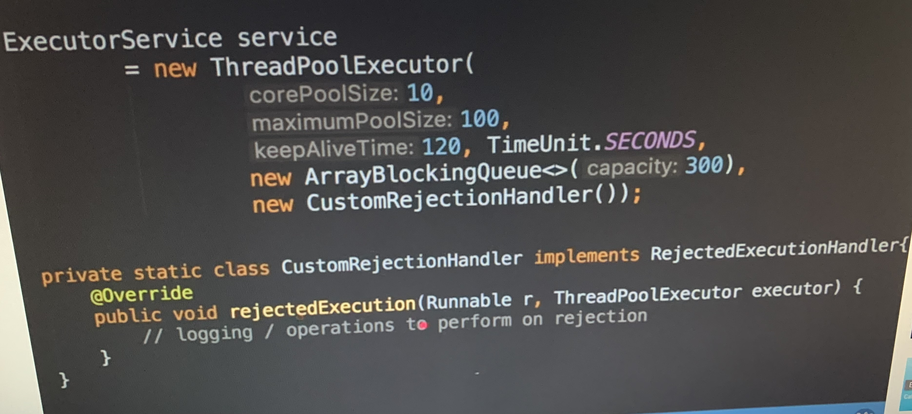

One can create threads extending Thread or implementing runnable. Both has the method void run() for operating thread operations. Now assuming that we want our run to return a value the this isn’t possible with thread and runnable. That’s why there is a Callable<T> Interface. And method T call().

In ExecutorService where we submit task. The submit() method which accepts the callable object which returns a value of Type<T>. The execute() method of ExecutorService expects a runnable object hence for a callable object it uses the submit() method and to store it in the variable of type Future<T>.
```java
int corecount=Runtime.getRuntime.availableProcessors();
ExecutorService service=Executors.newFixedThreadPool(corecount);
for(int i=0;i<1000;i++){
	Future<Integer> future=service.submit(new Task()); //Task implements Callable<Integer>
}
```
***Volatile vs atomic***

 
Here thread1 and thread2 are run together but the variable might not change due to the Visibility problem where thread1 and thread 2 do not reflect changes as they are not aware of the changes undergone in the cache.
The reason underlies in the way the memory is structured.

 

Here we see the variable values do not reflect the changes from cache unless we declare the variable as volatile where we actually indiacate that the variable has to impact the memory and pick changes from there rather than the local cache.
 

The next problem lies when we have the synchronization problem for any compound operations.
 

Consider this example where value is being incremented by 2 threads we would want it to be synchronously behaving but this will based on our processors behave like so
• first change value to 2 by thread 1
• again thread 2 would change value to 2 from 1 since it doesn’t know that thread 1 has changed the value prior to this
To solve this one can approach 2 solutions 1 the AtomicInteger or synchronize the blocks.

 


Using synchronized keyword one can make sure that only one thread can enter the block to do the operation.

 


One can also choose to use AtomicInteger to ensure that read and write in a thread is done atomically. It’s the responsibility of the jvm to do the operations atomically. Atomic in java also offers methos to increment, decrement or compare.

```java
AtomicInteger value= new AtomicInteger(1);
value.increment();
```

If there is a visibility problem, use volatile and if there is a synchronization problem use Atomic.

***ThreadLocal***

Consider the code where you need a Dateformat Object for some task. Each task is taken up by one thread and each thread would take a required object.

```java
public class UserService {

	public static void main(String[] args) {
		/*
		 * DateFormat object for each thread and for each task
		 */
		new Thread(()->{
			String birthdate=new UserService().birthDate(100);
			System.out.println(birthdate);
		}).start();
		
		new Thread(()->{
			String birthdate=new UserService().birthDate(100);
			System.out.println(birthdate);
		}).start();
		
		new Thread(()->{
			String birthdate=new UserService().birthDate(100);
			System.out.println(birthdate);
		}).start();
		
	}
	
	public String birthDate(int userId) {
		Date birthDate=birthDatefromDB(userId);
		SimpleDateFormat df=new SimpleDateFormat("yyyy-MM-dd");
		return df.format(birthDate);
	}

}

```


 

Consider the situation with more tasks 10 or 100 or 1000 or millions of tasks.

```java
public class UserService {

	public static void main(String[] args) {
		/*
		 * DateFormat object for each thread and for each task
		 */
		for(int i=0;i<100;i++) {
			int id=i;
			new Thread(()->{
				String birthdate=new UserService().birthDate(id);
				System.out.println(birthdate);
			}).start();

		}
	}
	
	public String birthDate(int userId) {
		Date birthDate=birthDatefromDB(userId);
		SimpleDateFormat df=new SimpleDateFormat("yyyy-MM-dd");
		return df.format(birthDate);
	}

}
```


 

Now this would be illogical and would consume a lot of memory for every single object. So we consider creating a global object.


 

This would save memory but this would cause data integrity issues and would not be thread safe. Now we could probably add locaks where only a single thread can be allowed to access the object at a time but this wopuld slow down the code entirely.
One task per object is too much memory and global objects need a solution for thread safety and locks being a solution would make the code slow. Now the middleground is to have a pool of thread and have these threads in the pool pick up the tasks and all these threads, each of them having one object required. This would be thread safe as each thread calls its own copy and has its own copy (Note it’s the thread and not a task).

```java

public class UserService {

private static ExecutorService threadPool=Executors.newFixedThreadPool(10);

	public static void main(String[] args) {
		/*
		 * DateFormat object for each thread and for each task
		 */
		for(int i=0;i<100;i++) {
			int id=i;
			threadPool.submit(()->{
				String birthdate=new UserService().birthDate(id);
				System.out.println(birthdate);
			});

		}
	}
	
	public String birthDate(int userId) {
		Date birthDate=birthDatefromDB(userId);
		SimpleDateFormat df=new SimpleDateFormat("yyyy-MM-dd");
		return df.format(birthDate);
	}

}

```


Advantages of Thread Local
•	It guarantees to maintain thread confinement safely
•	Create instances per thread instead of tasks or global instance increasing performance and making efficient use of memory
•	Ensures same context is used for particular thread, like a particular flow should have a single context
Eg: public static ThreadLocal<T> holder=new ThreadLocal();
usecases: LocaleContextHolder,SecurityContextHolder,DatatimeContextHolder etc

=>make sure to cleanup after using threadlocal

***Parallelism***
Parallelism is the process ofdoing a lot of task at once to speed up the program.
In Java one can achieve parallelism provided the cpu had more than 1 core( dual core having 2 threads to run in parallel, 3 cores run 3 thread in parallel and so on)
We can achieve parallelism by simply running custom thread or by creating thread pools(ExecutorService, ForkJoinPool, Custom ThreadPools(in webservers.
OS is generally responsible for assigning Cores for processing. It consist of a scheduler to do this and varies across systems.

```java
import java.util.concurrent.ExecutorService;
import java.util.concurrent.Executors;

public class Parallelism {
	public static void main(String[] args) {
		new Thread(new Runnable() {

			@Override
			public void run() {
				processTax(user1);  //task1
			}
			
		}).start();
		
		new Thread(new Runnable() {

			@Override
			public void run() {
				processTax(user2);  //task2
			}
			
		}).start();
		
		heavyCalculations();    //task3
	}
}

```

In java 8:
```java
import java.util.concurrent.ExecutorService;
import java.util.concurrent.Executors;

public class Parallelism {
	public static void main(String[] args) {
		
		new Thread(()->processTax(user1)  //task1
			).start();
		
		new Thread(()->processTax(user2)).start();//task2
		
		heavyCalculations();    //task3
	
	}
}

```

Using Executor Service and Pools to achieve parallelism

```java
import java.util.concurrent.ExecutorService;
import java.util.concurrent.Executors;

public class Parallelism {
	public static void main(String[] args) {		
		//create Parallelism using Thread Pool
		ExecutorService serve=Executors.newFixedThreadPool(4);
		serve.submit(()->processTax(user1));
		serve.submit(()->processTax(user2));
		
		heavyCalculations();
	}
}

```java

***Concurrency***
Consider an application to book tickets.
If there are threads running in a single core you never know the order in which threads are executed. It could be scheduled randomly. We cannot expect programs to run in the same order as we write it order may change. In best cases the threads could execute in order one after other like thread1 first executes completely and thread 2 after that starts its execution. Or it could both execute in between of each other like show in the diagram bewol where each condition is executed by each of the thread. Even in multiple core both the cores with thread each might execute together and book tickets from both the thread. Which results in duplicate tickets again.

```java
public class Concurrency {

	public static void main(String[] args) throws InterruptedException{
		
		new Thread(()->{
			if(available_tickets>0) {
				booktickets();
				available_tickets--;    //task1 is accessing shared variable
			}
		}).start();
		
		new Thread(()->{
			if(available_tickets>0) {
				booktickets();
				available_tickets--;    //task2 is accessing shared variable
			}
		}).start();


```

 

Concurrency occurs when multiple threads might have to access or update or both a shared resource or may be multiple tasks have to be coordinate together.
Java offers multiple ways to achieve this like locks/synchronized, Atomic classes, Concurrent Data Structure (concurrentHashmap, BlockingQueue), CompletableFuture, Countdown Latch/ CyclicBarrier/Semaphore/Phaser.
The tickets can be assigned using locks like below.

```java
public class Concurrency {

	public static void main(String[] args) throws InterruptedException{
		
		
		new Thread(()->{
			lock.lock();
			if(available_tickets>0) {
				booktickets();
				available_tickets--;    //task1 is accessing shared variable
			}
			lock.unlock();
		}).start();
		
		new Thread(()->{
			lock.lock();
			if(available_tickets>0) {
				booktickets();
				available_tickets--;    //task2 is accessing shared variable
			}
			lock.unlock();
		}).start();
	}

}

```


***ExecutorService***
Instead of creating n number of threads for n tasks (say n=1000) which would be costly we would work on creating m number of threads(say m= 10) and take up 1000 tasks by these 10 threads and just execute to let the thread puck up tasks.

```java
ExecutorService service=Executors.newFixedThreadPool(10);
for(int i=0;i<1000;i++){
	service.execute(new Task());
//here the threads in pool of 10 will pick up tasks themselves
}
```

Threadpool internally keeps a blocking queue which handles concurrent operations and the threads all together does the fetching of new task executing it and returning back, once task is completed fetch another task.
Ideal pool size depends on the tasks involved. A I/O intensive operation will need a large number of threads so that even if some threads go to wait remaining threads can pick up new tasks. A CPU intensive operation might give good performance based on number of cores/ OS threads possible.

```java
int corecount=Runtime.getRuntime.availableProcessors();
ExecutorService service=Executors.newFixedThreadPool(corecount);
for(int i=0;i<1000;i++){
	service.execute(new Task());
}
```

Advantages of Parallelism and Concurrency:
•	Split sequential flow to independent components
•	Use threads/ thread pools to speed up by parallel execution
•	Whenever there is change in state of shared resource manage the resource using concurrency tools
•	When independent components/threads need to coordinate concurrency tools bring fault tolerance to the table 

***Executor Service***
Thread pool Framework in java is Executor Service. Say you have a main thread which run a new thread asynchronously. The main thread keeps calling a thread when needed executes it asynchronously and exits it.


```java
public static void main(String[] args) {
		for(int i=0;i<10;i++) {
		new Thread(()->System.out.println("Thread name: "
		+Thread.currentThread().getName())).start();
		}
		System.out.println("Thread name: "+Thread.currentThread().getName());
	}
```


 


This is really expensive as creating threads are expensive and hence it is better to have a fixed number of threads a fixed number of threads -> create thread pools.   


We create thread pools and submit 1000 or more tasks to it. We would want these threads to pick up each task and on completion of current task execution pick another task and so on till all tasks are completed.


 
Within thread pool executor service we have a queue that it creates internally that it creates or uses to store all tasks to which all tasks are submitted. Each thread fetch next task from queue executes it and the fetch the next and executes and so on.
```java
public static void main(String[] args) {
		
		ExecutorService service=Executors.newFixedThreadPool(10);
		for(int i=0;i<100;i++) {
			service.execute(new Task());
		}
		System.out.println("Thread name: "+Thread.currentThread().getName());
	}
	
	static class Task implements Runnable{
		@Override
		public void run() {
			System.out.println("Thread name: "+Thread.currentThread().getName());	
		}
	}
```

Generally, when the operations are CPU intensive we might have to check on how many applications are running on the same CPU. No matter how many thread one creates in the pool for CPU intensive operations the number of threads that can be utilized would be only as per the number of CPU cores. So it is logical to have number of threads equal to number of cores available in CPU cores.

```java
public static void main(String[] args) {
		
		int corecount=Runtime.getRuntime().availableProcessors();
		ExecutorService service=Executors.newFixedThreadPool(corecount);
		for(int i=0;i<100;i++) {
			service.execute(new CPUIntensiveTask());
		}
		System.out.println("Thread name: "+Thread.currentThread().getName());
	}
	
	static class CPUIntensiveTask implements Runnable{
		@Override
		public void run() {
			//some CPU intesive operation	
		}
	}

```

Say we have a IO Intensive operation may be a task calls a Http url or a database operation. We need to have more threads on the thread pool as in this case there could be a lot of threads waiting for the IO operation and we need some thread ready to carry out some other independent tasks.

```java
public static void main(String[] args) {
		
		ExecutorService service=Executors.newFixedThreadPool(100);
		for(int i=0;i<100;i++) {
			service.execute(new IOIntensiveTask());
		}
		System.out.println("Thread name: "+Thread.currentThread().getName());
	}
	
	static class IOIntensiveTask implements Runnable{
		@Override
		public void run() {
			//some IO operation that cause thread block/wait	
		}
	}
```

So before deciding on number of threads need for a thread pool have a check on task submissions and average task wait time before deciding on pool size since too many threads will increase memory consumption and once must choose to create them wisely.

• fixed Thread Pool: fixed number of threads, blocking queue that holds the tasks and one by one tasks are taken by these fixed number of threads.

```java
public static void main(String[] args) {
		
		ExecutorService service=Executors.newFixedThreadPool(10);
		for(int i=0;i<100;i++) {
			service.execute(new Task());
		}
		System.out.println("Thread name: "+Thread.currentThread().getName());
	}
	
	static class Task implements Runnable{
		@Override
		public void run() {
			System.out.println("Thread name: "+Thread.currentThread().getName());	
		}
	}
```


• Cached thread pool: number of threads are not fixed. It has a synchronous queue which holds a task a single item. When a task is created the task is pushed into the synchronous queue and the queue finds the thread that is free to take up the task and then assigns the task to this thread. And if any thread is not free then we create a new thread and add to the pool and assign the task accordingly. If the thread is idle for 60 seconds its killed.

```java
	public static void main(String[] args) {
		
		ExecutorService service=Executors.newCachedThreadPool();
		for(int i=0;i<100;i++) {
			service.execute(new Task());
		}

	}
	
	static class Task implements Runnable{
		@Override
		public void run() {
			//short lived task	
		}
	}

```


• Scheduled Thread Pool: task that has to be executed with fixed/certain delay or fixed rate or at certain timeframes. The queue is a delay queue and here the tasks are distributed/ordered based on when it has to be executed and might not be sequential based on the way you insert the task. Threads will be created if needed.

```java
public static void main(String[] args) {
		
		ScheduledExecutorService service=Executors.newScheduledThreadPool(10);
		//task runs after 10 sec delay
		service.schedule(new Task(), 10, TimeUnit.SECONDS);
		//task runs repeatedly every 10 seconds
		service.scheduleAtFixedRate(new Task(), 15, 10, TimeUnit.SECONDS);
		//task runs repeatedly every 10 seconds after previod task completes
		service.scheduleWithFixedDelay(new Task(), 15, 10, TimeUnit.SECONDS);
	}
	
	static class Task implements Runnable{
		@Override
		public void run() {
			//task that needs to run based on schedule	
		}
	}
```


• Single Threaded Executor: Same as fixed Thread Pool but with one single thread. A new thread is recreated when its killed. This is used for ensuring sequence is maintained, when one wants a task n to be executed before a task n+1 and so on. This can be ensured only with single thread.

```java
public static void main(String[] args) {
		
		ExecutorService service=Executors.newSingleThreadExecutor();
		for(int i=0;i<100;i++) {
			service.execute(new Task());
		}

	}
	
	static class Task implements Runnable{
		@Override
		public void run() {
			//sequence is important here	
		}
	}
```





***Callable and Future***
•	When thread will have values to be returned that’s when Callable is used. The run() returns void and call() returns a value with it
•	Future gives placeholder to something that would achieve sometime in future


 

```java
public static void main(String[] args) {
		ExecutorService service =Executors.newFixedThreadPool(10);
		Future<Integer> future=service.submit(new Task());
	}
	
	static class Task implements Callable<Integer>{
		@Override
		public Integer call() throws Exception {
			Thread.sleep(1000);
			return new Random().nextInt();
		}
	}
```

•	When callable is being run if main method calls the future.get() method it might block further operation waiting for the value to be placed on the future placeholder

```java
public static void main(String[] args) {
		ExecutorService service =Executors.newFixedThreadPool(10);
		Future<Integer> future=service.submit(new Task());
		
		try {
			Integer result=future.get(); //a blocking statement
		}
		catch(InterruptedException|ExecutionException e) {
			e.printStackTrace();
		}
	}
	
	static class Task implements Callable<Integer>{
		@Override
		public Integer call() throws Exception {
			Thread.sleep(1000);
			return new Random().nextInt();
		}
	}
```

•	In such case main method goes to blocked state and can be resumed to runnable state only after the placeholder value is set


•	Hence loops during Callable should be handled with caution
•	You can solve this by setting timeouts for future.get method to mention how long its willing to wait for result.
•	future.cancel(false); =>cancels the task
•	future.isCancelled(); =>returns true if task was cancelled 
•	future.isDone(); =>returns true if task is completed(successfully or otherwise)

```java
public static void main(String[] args) {
		ExecutorService service =Executors.newFixedThreadPool(10);
		Future<Integer> future=service.submit(new Task());
		
		try {
			Integer result=future.get(1,TimeUnit.SECONDS); //a blocking statement
		}
		catch(InterruptedException|ExecutionException|TimeoutException e) {
			e.printStackTrace();
		}
	}
```

***Asynchronous Operations using CompletableFuture***
Consider the below synchronous operations where each operations has to wait for the next to proceed

```java
for(Integer id: employeeIds) {
			//fetch employee details from db
			Future<Employee> future=service.submit(new EmployeeFetcher(id));
			Employee emp=future.get();//blocking
			//fetch employee tax rate from REST Service
			Future<TaxRate> ratefuture=service.submit(new TaxRateFetcher(emp));
			TaxRate taxrate=ratefuture.get();//blocking
			//calculate current year tax
			BigDecimal tax=calculateTax(emp,taxrate);
			//send email to employee using rest service
			service.submit(new SendEmail(emp,tax));
		}
```

This is not a very good way due to following problems

•	Expensive Threads
•	Blocking I/O ops
•	Limited Scalability
Instead we can use non blocking I/O or Asynchronous API like use CompletableFuture.

•	Completable Future can be used to perform **possible asynchronous(non-blocking) computation** and **trigger dependent computations** which could also be asynchronous
•	It provides a way to not block the main method thread
•	It uses callback chaining where completable future supllies asynchronous operations (like here fetch and do something and next fetch and do something etc no blocking occurs)
•	We must use asynchronous when
•	CPU utilization should be efficient
•	High scalability and high throughput is expected
•	Data locality and less context switches comes into picture
•	Reactive programming
•	Disavantages of going asynchronous
•	Hard to write,debug or stacktrace
•	Difficult to write testcases
•	End to end testing is difficult

**Java has a project loom with coroutines to get a middle ground between synchronous and asynchronous api***


```java
for(Integer id: employeeIds) {
			CompletableFuture.supplyAsync(()->fetchemployee(id))
			.thenApplyAsync(employee->fetchtaxrate(employee))
			.thenApplyAsync(taxrate->calculateTax(taxrate))
			.thenAcceptAsync(taxvalue->sendEmail(taxvalue));
			
			//thenApplyAsync do some other thing with other thread till you get what you need
		}
```

***Conditions and Locks***

•	Control the number of threads entering a block of code and wait or block for a condition to match.
•	The signal method awakes the thread that has been waiting for the signal for the longest (fairness)
•	signalAll() will awake all the threads and move it from blocked state to Runnable state


```java
private Lock lock=new ReentrantLock();
	private Condition conditionmet=lock.newCondition();
	
	public void method1() throws InterruptedException{ //thread 1
		lock.lock();
		try {
			conditionmet.await(); //suspend
			//other operations //resume it here
		}finally {
			lock.unlock();
		}
	
	}
	
	public void method2() { //thread 2
		lock.lock();
		try {
			//do some operations
			conditionmet.signal();
		}finally {
			lock.unlock();
		}
	}
```

Lock and condition is similar to wait and notify:
```java
public synchronized void execute() {
		//wait for monitor notify
		try {
			monitor.wait();
		}catch(InterruptedException e) {
			e.printStackTrace();
		}
		monitor.notify();
		//notify the thread waiting for monitor
		
		monitor.notifyAll();
		//notify all threads
		}
	
	}
```

```java
lock.lock();
//wait for monitor notify
try {
		conditionmet.await(); 

}catch(InterruptedException e) {
		e.printStackTrace();
}

condition.signal();
//notify the thread waiting for monitor

condition.signalAll();
//notify all threads
lock.unlock();
}
```

***Reentrant Locks and Locks***

•	Locks will allow to restrict access to a shared resource such that only one thread can access the resource
•	Avoid multiple threads from accessing the resource which might cause inconsistency
•	It is different from synchronized which works in the same scope and implicit
•	Locks are explicit create a variable of Lock type
•	Can be locked and unlocked in any scope
•	trylock and trylock features
•	To avoid issues of blocking other threads make sure to use try finally block
•	Lock allows to call lock on the same object multiple times
•	No of locks should be equal to number of unlocks
•	private Lock lock=new ReentrantLock(true); makes the lock fair. When locks are fair all threads are allowed resources in order based on who waited the longest and the resource are given
•	private Lock lock=new ReentrantLock(false); facilitates the barge-in unfair mechanism where threads are allowed to unlock not necessarily in order but as soon as they come asking for a lock. Say there is a resource available and there are 3 threads waiting for the lock but thread4 comes in asking for the lock instead of giving the lock to thread 1 it gives lock to 4.
•	Fair locks are slow but gives equal access to all resources
•	Unfair locks are faster as the needs are served immediately but it may cause data starvation
•	tryLock tries to get lock and returns a Boolean value notifying if the lock is available it does not comply with fairness
•	tryLock(timeout) is a timeout that is given to wait for lock this complies with fairness

***Producer Consumer Problem***
	say you have a fixed capacity queue to which producer posts contents and consumers access them.
	Its important to make sure the producer and consumer access and produce the right way 
	This can be done using the Blocking queue as so:

```java
	public static void main(String[] args) {
		BlockingQueue<Integer> queue=new ArrayBlockingQueue<Integer>(10);
		
		//producer
		final Runnable producer=()->{
			while(true) {
				try {
					queue.put(1);
				} catch (InterruptedException e) {
					// TODO Auto-generated catch block
					e.printStackTrace();
				}
			}
		};
		//consumer
		final Runnable consumer=()->{
			while(true) {
				try {
					Integer i=queue.take();
				} catch (InterruptedException e) {
					// TODO Auto-generated catch block
					e.printStackTrace();
				}
				//process i
			}
		};
		
	}

```

But lets try creating our own BlockingQueue
```java

import java.util.LinkedList;
import java.util.Queue;
import java.util.concurrent.locks.Condition;
import java.util.concurrent.locks.ReentrantLock;

public class MyBlockingQueue<E> {
	private int max;
	private Queue<E> queue;
	private ReentrantLock lock=new ReentrantLock(true);
	private Condition Empty=lock.newCondition();
	private Condition Full=lock.newCondition();
	
	public MyBlockingQueue(int size) {
		this.queue=new LinkedList<>();
		this.max=size;
	}
	
	public void put(E e) throws InterruptedException {
		lock.lock();
		try {
			while(queue.size()==max) {
				//you would want to block the operation when its full
				Full.await();
			}
			queue.add(e);
			//when its added its not empty anymore
			Empty.signalAll();
		}
		finally {
			lock.unlock();
		}
	}
	
	public E take() throws InterruptedException {
		lock.lock();
		try {
			while(queue.size()==0) {
				//you would want to block the operation its empty
				Empty.await();
			}
			E e=queue.remove();
			//when you remove its not full anymore so signal it
			Full.signalAll();
			return e;
		}
		finally {
			lock.unlock();
		}
	}
}


```

```java
public static void main(String[] args) {
		MyBlockingQueue<Integer> queue=new MyBlockingQueue<Integer>(10);
		
		//producer
		final Runnable producer=()->{
			while(true) {
				try {
					queue.put(1);
				} catch (InterruptedException e) {
					// TODO Auto-generated catch block
					e.printStackTrace();
				}
			}
		};
		//consumer
		final Runnable consumer=()->{
			while(true) {
				try {
					Integer i=queue.take();
				} catch (InterruptedException e) {
					// TODO Auto-generated catch block
					e.printStackTrace();
				}
				//process i
			}
		};
		
	}
```


References: https://www.youtube.com/channel/UCiz26UeGvcTy4_M3Zhgk7FQ


